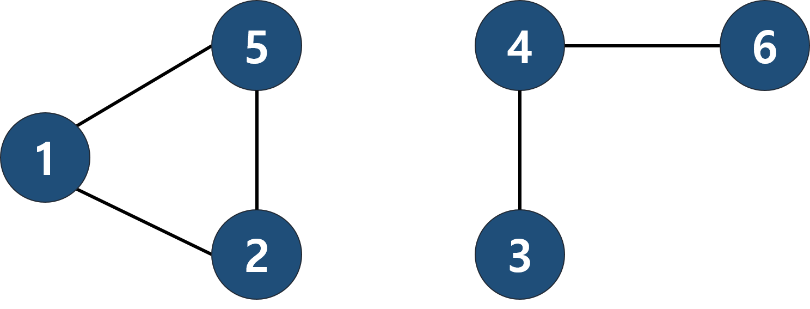

# (11724) 연결 요소의 개수
## :100: Algorithm
[문제 바로가기](https://www.acmicpc.net/problem/11724)

## 문제
방향 없는 그래프가 주어졌을 때, 연결 요소 (Connected Component)의 개수를 구하는 프로그램을 작성하시오.

## 입력
첫째 줄에 정점의 개수 N과 간선의 개수 M이 주어진다. (1 ≤ N ≤ 1,000, 0 ≤ M ≤ N×(N-1)/2) 둘째 줄부터 M개의 줄에 간선의 양 끝점 u와 v가 주어진다. (1 ≤ u, v ≤ N, u ≠ v) 같은 간선은 한 번만 주어진다.

## 출력
첫째 줄에 연결 요소의 개수를 출력한다.

## 풀이
우선 문제를 풀기전에 연결 요소가 무엇인지 알아야합니다.  
연결 요소란 각각의 나누어진 그래프라고 생각해 주시면 됩니다.

위의 그림을 본다면 [1, 2, 5]와 [3, 4, 6] 2개의 연결 요소가 존재한다는 것을 알 수 있습니다.  

연결요소를 판단하기 위해서는 DFS, BFS를 사용하여도 되지만 결국 집합을 찾는 것이기 때문에 union-find자료구조를 사용하는 것도 좋은 방법입니다.  

그래서 해당 문제는 union-find를 이용하여 풀어보았습니다.  

```cpp
#include <iostream>
#include <vector>

using namespace std;

int find(vector<int>&parents, int n){
    if(parents[n] == n) return n;
    return parents[n] = find(parents, parents[n]);
}

void union_node(vector<int>&parents, int n1, int n2){
    parents[n1] = n2;
}

int main(int argc, char const *argv[]){
    ios_base::sync_with_stdio(false);
    cin.tie(NULL);
    cout.tie(NULL);

    int n, m, n1, n2, ans = 0;
    cin >> n >> m;

    vector<int> parents(n + 1);
    for(int i = 1; i <= n; ++i)
        parents[i] = i;

    while(m--){
        cin >> n1 >> n2;

        n1 = find(parents, n1);
        n2 = find(parents, n2);

        if(n1 != n2)
            union_node(parents, n1, n2);
    }

    for(int i = 1; i <=n; ++i)
        if(parents[i] == i)
            ++ans;

    cout << ans << "\n";
    return 0;
}
```