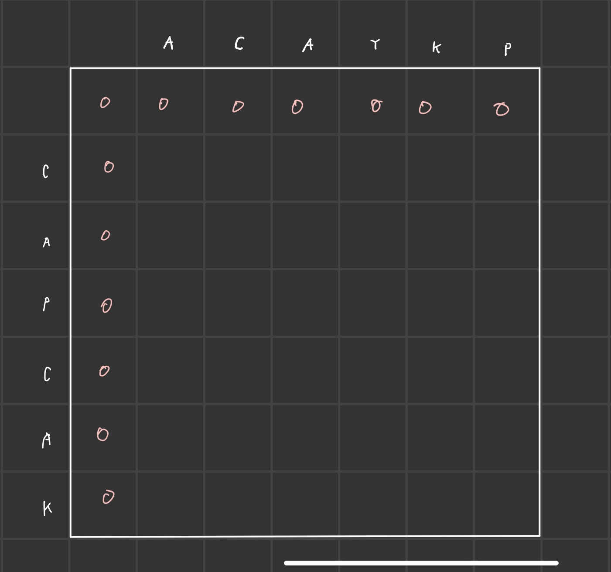

# (9252) LCS2
## :100: Algorithm
[문제 바로가기](https://www.acmicpc.net/problem/9252)
## 문제
LCS(Longest Common Subsequence, 최장 공통 부분 수열)문제는 두 수열이 주어졌을 때, 모두의 부분 수열이 되는 수열 중 가장 긴 것을 찾는 문제이다.

예를 들어, ACAYKP와 CAPCAK의 LCS는 ACAK가 된다.

## 입력
첫째 줄과 둘째 줄에 두 문자열이 주어진다. 문자열은 알파벳 대문자로만 이루어져 있으며, 최대 1000글자로 이루어져 있다.

## 출력
첫째 줄에 입력으로 주어진 두 문자열의 LCS의 길이를, 둘째 줄에 LCS를 출력한다.

LCS가 여러 가지인 경우에는 아무거나 출력하고, LCS의 길이가 0인 경우에는 둘째 줄을 출력하지 않는다.

## 풀이
LCS는 두 수열 중 어떠한 인덱스들을 제외 하였을 때, 같아지는 수열중 가장 긴 수열을 말합니다.  
이때 해당 수열은 다이나믹 프로그랭밍으로 찾을 수 있습니다.  

두 문자열 ACAYKP, CAPCAK를 입력받은 경우 아래와 같은 방식으로 가장 긴 문자열을 확인 할 수 있습니다.  



한 문자열의 인덱스에 대하여 다른 문자열의 모든 인덱스를 확인하게 됩니다.  
한 문자열의 특정 인덱스에 대하여 다른 문자열의 특정 인덱스가 같다면 대각 위의 값 + 1을 같게 되며 같지 않다면 이전 문자열중 가장 긴 문자열을 가지고 오면 됩니다.  
이전 문자열 같은 경우는 위의 문자열과 왼쪽의 문자열의 길이 중 큰 것을 고르면 됩니다.  


위의 그림과 같이 문자열 CAPCAK의 특정 인덱스에 대하여 다른 문자열의 인덱스를 모두 검정해 보면 C인덱스의 경우 가장 긴 문자열은 C가 되고 A인덱스의 경우 가장 긴문자열은 AC가 됩니다.  
이와 같은 방식으로 끝까지 가면 아래와 같습니다.  


위의 과정을 점화식으로 표현하면

만약 s1[i] == s2[j]
- dp[i][j] = dp[i-1][j-1] + 1;  

아니면
-  dp[i][j] = max(dp[i-1][j], dp[i][j-1]);

가 되고 이를 코드로 나타내면 아래와 같습니다.  

```cpp
void LCS(vector<vector<int>>&dp, string s1, string s2){
    for(int i = 1; i <= s1.size(); ++i)
        for(int j = 1; j <= s2.size(); ++j){
            if(s1[i-1] == s2[j-1])
                dp[i][j] = dp[i-1][j-1] + 1;
            else
                dp[i][j] = max(dp[i-1][j], dp[i][j-1]);
        }
}
```

이후 문자열의 경우 반대로 따라올라가면 됩니다.  
dp를 한 테이블 마지막 인덱스에서 부터 거꾸로 올라가며 아래의 과정의 반복을 통해 문자열을 만들어 갑니다.  

- 현제의 인덱스와 왼쪽과 값이 갔다면 인덱스를 왼쪽으로 옮김
- 현제의 인덱스와 위의 값이 갔다면 인덱스를 위로 옮김
- 현제의 인덱스 값 - 1 dl 대각선의 인덱스와 같다면 해당 값의 문자를 넣고 데각선쪽으로 옮김

위의 과정이 끝나면 뒤집어진 문자열을 얻을 수 있고 다시 뒤집어 반환해 주면 됩니다.  

```cpp
string makeSeqStr(vector<vector<int>>&dp, int l1, int l2, string s1){
    string s;

    while(dp[l1][l2] > 0){
        if(dp[l1][l2] == dp[l1][l2-1])
            --l2;
        else if(dp[l1][l2] == dp[l1-1][l2])
            --l1;
        else if(dp[l1][l2] - 1 == dp[l1-1][l2-1]){
            s.push_back(s1[l1-1]);
            --l1;
            --l2;
        }
    }

    reverse(s.begin(), s.end());
    
    return s;
}
```