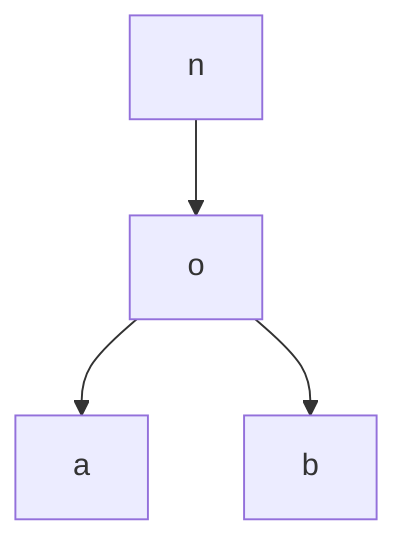

# BOJ 2179 비슷한 단어

## :100: Algorithm

[문제 바로가기](https://www.acmicpc.net/problem/2179)

## 문제

N개의 영단어들이 주어졌을 때, 가장 비슷한 두 단어를 구해내는 프로그램을 작성하시오.

두 단어의 비슷한 정도는 두 단어의 접두사의 길이로 측정한다. 접두사란 두 단어의 앞부분에서 공통적으로 나타나는 부분문자열을 말한다. 즉, 두 단어의 앞에서부터 M개의 글자들이 같으면서 M이 최대인 경우를 구하는 것이다. "AHEHHEH", "AHAHEH"의 접두사는 "AH"가 되고, "AB", "CD"의 접두사는 ""(길이가 0)이 된다.

접두사의 길이가 최대인 경우가 여러 개일 때에는 입력되는 순서대로 제일 앞쪽에 있는 단어를 답으로 한다. 즉, 답으로 S라는 문자열과 T라는 문자열을 출력한다고 했을 때, 우선 S가 입력되는 순서대로 제일 앞쪽에 있는 단어인 경우를 출력하고, 그런 경우도 여러 개 있을 때에는 그 중에서 T가 입력되는 순서대로 제일 앞쪽에 있는 단어인 경우를 출력한다.

## 입력

첫째 줄에 N(2 ≤ N ≤ 20,000)이 주어진다. 다음 N개의 줄에 알파벳 소문자로만 이루어진 길이 100자 이하의 서로 다른 영단어가 주어진다.

## 출력

첫째 줄에 S를, 둘째 줄에 T를 출력한다. 단, 이 두 단어는 서로 달라야 한다. 즉, 가장 비슷한 두 단어를 구할 때 같은 단어는 제외하는 것이다.

## 풀이

해당 문제는 트리를 이용하면 해결 할 수 있는 문제였습니다.

문제를 간략하게 정리 하자면 가장 긴 부분 문자열을 가지는 2개의 문자를 찾는 문제입니다.

가장 간단하게 생각 할 수 있는 방법은 2중 for문을 이용하여 전수조사를 해보는 방법이 있습니다.

하지만 해당 문제의 입력은 최대 (20,000)개이고 O(n^2)을 하게 된다면 총 400,000,000번을 비교 하게되며 여기에 문자열 길이까지 고려하게 된다면 40,000,000,000번을 비교하게 되므로 시간초과가 발생하게 됩니다.

그러므로 다른 방법을 생각해 보아야 합니다.

제가 생각한 방법은 Tree를 이용하는 방법입니다.

예를 들어 "noa"와 "nob"라는 문자열이 있다고 가정해 봅시다.
그럼 아래와 같은 트리를 만들 수 있습니다.



그럼 n이라는 node는 2, o라는 node는 2의 값을 가지게 되며 , a와 b node는 각,각 1의 값을 가지게 됩니다.

위처럼 입력 받은 문자열에 대하여 모든 트리를 만들게 된다면 그다음은 분기되는 가장 먼 곳을 찾아야 합니다.

noa라는 문자열에 대하여 해당 tree를 따라가다 보면 2가지의 경우를 만나게 됩니다. 
1. 1의 값을 가지는 노드를 만난다.
	- 해당 문자 인덱스 값이 가장 긴 부분 문자열의 길이가 됩니다.
2. 문자 마지막 노드를 만난다.
	- 해당 문자 인덱스 값 + 1이 가장 긴 부분 문자열의 길이가 됩니다.

위의 방법으로 각 문자열에 해당하는 가장 긴 부분 문자열의 노드를 유지하는 배열을 만들고 가장긴 부분 문자열을 가지는 노드를 찾습니다.

이후 해당 동일한 노드를 가지는 문자열 2개를 출력해 주면 해당 문제를 해결 할 수 있습니다.

```java
import java.io.*;
import java.util.*;
import java.util.Map;

class Node {
    private int count;
    private Map<Character, Node> child;

    public Node() {
        count = 0;
        child = new HashMap<>();
    }

    public int getCount() {
        return count;
    }

    public void counting() {
        ++count;
    }

    public Map<Character, Node> getChild() {
        return child;
    }
}

class Problem {
    private Node root;
    private String[] strings;

    public Problem() {
        try {
            input();
            output();
        } catch (Exception e) {
            e.printStackTrace();
        }
    }

    private void input() throws Exception {
        BufferedReader br = new BufferedReader(new InputStreamReader(System.in));
        strings = new String[Integer.parseInt(br.readLine())];

        root = new Node();
        for (int i = 0; i < strings.length; ++i) {
            Node node = root;
            strings[i] = br.readLine();
            for (char c : strings[i].toCharArray()) {
                if (!node.getChild().containsKey(c)) {
                    node.getChild().put(c, new Node());
                }
                node = node.getChild().get(c);
                node.counting();
            }
        }
    }

    private void output() {
        System.out.print(solve());
    }   

    private String solve() {
        Map.Entry<Integer, Node> max = Map.entry(0, root);
        Node[] counting = new Node[strings.length];
        for (int i = 0; i < strings.length; ++i) {
            Map.Entry<Integer, Node> branch = count(root.getChild().get(strings[i].charAt(0)), root, strings[i], 0);
            counting[i] = branch.getValue();
            if (branch.getKey() > max.getKey()) {
                max = branch;
            }
        }

        int count = 0;
        StringBuilder sb = new StringBuilder();
        for (int i = 0; i < strings.length && count < 2; ++i) {
            if (counting[i] == max.getValue()) {
                sb.append(strings[i]).append("\n");
                ++count;
            }
        }
        return sb.toString();
    }

    private Map.Entry<Integer, Node> count(Node curr, Node prev, String s, int idx) {
        if (curr.getCount() == 1) {
            return Map.entry(idx, prev);
        } else if (idx == s.length()-1) {
            return Map.entry(idx + 1, curr);
        }
        return count(curr.getChild().get(s.charAt(idx+1)), curr, s, idx+1);
    }
}

public class Main {
    public static void main(String[] args) {
        new Problem();
    }
}

```